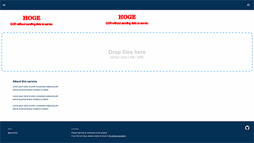

## image-diff [](https://crates.io/crates/image-diff) [](https://docs.rs/image-diff/0.1.1/image_diff/)
An image diff library written in rust



### Definition

``` rust
pub fn diff(before: &DynamicImage, after: &DynamicImage) -> Result<DynamicImage>
```

### Usage

```toml
[dependencies]
image = "0.23.4"
image-diff = "0.1.0"
```

``` rust
let before = image::open("before.png");
let after = image::open("after.png");
let image_diff = diff(&before, &after).unwrap();
image_diff.save("image_diff.png");
```
